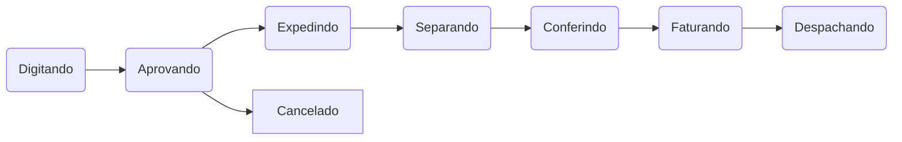

# Criando pedido

 Depois de logado, selecione o ícone "pedidos":{.is-info}

---

Escolha a coleção que deseja trabalhar

---

Selecione os itens do pedido:

---

> Ao **manter um produto pressionado**, serão exibidas suas respctivas fotos, caso estejam cadastradas.
{.is-info}

Ao escolher um item, abrirá um menu com cores e tamanhos. Você poderá navegar pelo menu de cores para facilitar sua escolha.

---

Escolha as cores e quantidades e depois pressione o botão verde.

---

Agora, é preciso adicionar infomações sobre o pedido. Cliente, forma de pagamento e outros.

---

Depois de confirmar todos os dados, é só finalizar seu pedido.

---

# Status do pedido
O status infoma o andamento de um pedido

# Enviar pedido para análise
Depois de terminar seu pedido, você precisa enviá-lo pra análise.

> Se o número de um pedido estiver negativo, significa que ele não está sincronizado.
{.is-warning}

---

Para enviar para análise, precione o pedido até aparecer a mensagem de confirmação:

---

Agora é só confirmar que seus gestores irão analisar o pedido!

# Editar um pedido
Fechou um pedido e esqueceu de algo? O cliente quis adicionar ou remover um novo item? É possível editar um pedido já feito e mudar seus produtos e forma de pagamento, dentre outros.

> Só é possível editar um pedido se ele estiver com o status "digitando".
{.is-warning}

---

Para isso, posicione seu dedo sobre o pedido em questão e o arraste da esquerda para a direita. O aplicativo ira abrir a tela com todos os itens de estoque. Você pode, ainda, tocar no pedido e clicar no ícone de edição.

### Duplicar pedido

É possível duplicar um pedido já existente, caso precise tirar um novo pedido igual ou muito parecido.

Escolha um pedido:

Clique no ícone copiar:

Informe os dados do cliente e pronto.

### Excluir pedido

Só é possível excluir um pedido se ele estiver com o status "digitando".

Escolha um pedido:

Depois clique no ícone da lixeira e confirme.

